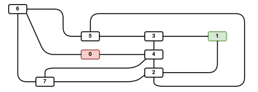

# Lemin

### Introduction

Le lemin est un projet qui traite du pathfinding simultané un peu comme Google Maps, à la différence qu'au lieu de traiter le trafic routier on traite des déplacements dans une fourmilière.


### Utilisation

Le Lemin lit sur l'entrée standard tous les éléments qui constituent la map en temps réel. En premier lieu il faut entrer chaque noeud un par un. Ensuite il faut rentrer les chemins possibles entre les différents nodes.

Le programme est capable de détecter les commentaires commençant par "#" et de les ignorer. À ne pas confondre avec les "##"  qui sont les préfixes des commandes.&#x20;

Voici un exemple de fourmillière



Comme on peut le constater il y a des noeuds reliers par des chemins. On peut aussi constater que le noeud 1 est en vert ce qui signifie sur le schéma que c'est le point de départ, de la même manière le 0 est en rouge ce qui signifie que c'est le point d'arrivée.

Voici maintenant en pratique qu'est-ce que le programme attend précisément en entrée:

```
14
##start
1 23 3
2 16 5
5 9 3
6 1 0
7 4 8
##end
0 9 5
0-4
0-6
1-3
#random comment
4-3
5-2
3-5
4-2
2-1
7-6
7-2
7-4
6-5
```

La première ligne permet d'indiquer le nombre de fourmis. Les lignes ayant pour préfixe "##" sont les lignes qui permettent de préciser le noeud de départ ou d'arrivée. Les ayant comme préfixe "#" sont seulement des commentaires, elles seront ignorées par le programme. Les lignes contenant trois nombres sont les lignes qui permettent de déclarer les nouveaux noeuds, le premier nombre correspond au nom du noeud, les deux suivantes correspondent à la position de ce dernier. Enfin les dernières lignes contenant un "-" sont les lignes qui permettent de déclarer les chemins entre les noeuds. L'exemple donné correspond au schéma donné plus haut.

### Temps réel

Le programme doit calculer les déplacements des fourmis en temps réel sans qu'il puisse y avoir plus d'une fourmi par chemins, Par conséquent toutes les fourmis doivent être réparties sur la map. Le tout doit être effectué avec le moins de déplacements possible.
